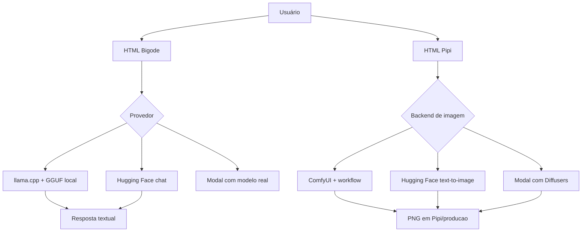

# Auditoria operacional Bigode IA + Pipi IA

## Conclusão curta

O **Llama/llama.cpp é um motor de inferência para modelos de linguagem em GGUF**. Ele não é o motor correto para executar FLUX, Stable Diffusion, VAE, LoRA ou outros componentes de geração de imagens. O Bigode deve usar llama.cpp para texto, dados e programação. A Pipi deve usar ComfyUI/Diffusers ou Hugging Face Inference para imagens.

## O que foi implementado

O Bigode recebeu um cliente opcional de Hugging Face para conversa, download versionado de arquivos e seleção de modelo no `config.json`. O modo local continua sendo o padrão. Para ativar Hugging Face, instale `huggingface_hub`, configure `HF_TOKEN`, selecione `modelo_provedor` como `huggingface` e reinicie.

A Pipi recebeu um servidor independente com catálogo compatível com a interface, detecção recursiva dos modelos na pasta externa, diagnóstico de Hugging Face, backend Hugging Face para text-to-image e adaptador de workflow para ComfyUI. O servidor não inventa imagens: se faltar backend, modelo ou workflow, o job termina com erro explicativo.

## API Hugging Face

A integração utiliza o cliente oficial `huggingface_hub.InferenceClient`. Para texto, usa `chat_completion`; para imagens, usa `text_to_image`; para arquivos, usa `hf_hub_download`. O token deve ser um token fine-grained com permissão de Inference Providers e deve ficar somente na variável de ambiente `HF_TOKEN`.

## Modal

O endpoint Modal que existia no projeto ainda é um **endpoint de teste**: ele confirma o contrato HTTP, mas devolve uma frase simulada. Ele não deve ser apresentado como LLM de produção. Para produção, será necessário instalar um motor real no container Modal, carregar pesos de um Volume e trocar a função simulada pelo servidor llama.cpp/vLLM ou por um cliente Hugging Face. Os pesos não devem ser embutidos na imagem; a documentação oficial do Modal recomenda Volumes para reduzir rebuilds e cold start.

## Etapas para colocar em funcionamento

1. Inicie o ComfyUI se quiser geração local. A Pipi pode ser iniciada sem ele, mas a criação real dependerá do ComfyUI ou de Hugging Face.
2. Para Hugging Face, instale `pip install -r requirements.txt` e defina `HF_TOKEN` na sessão do PowerShell. Nunca cole o token no HTML, no GitHub, no JSON ou no ZIP.
3. Defina `HF_IMAGE_MODEL`, por exemplo `black-forest-labs/FLUX.1-schnell`, e inicie a Pipi. O backend HF é usado quando não há ComfyUI ou quando o job informa `backend: huggingface`.
4. Para ComfyUI, defina `PIPI_COMFYUI_URL=http://127.0.0.1:8188`, coloque um workflow exportado no formato API em `PPIA/workflow.json` e teste primeiro um prompt simples.
5. Para o Bigode local, mantenha o GGUF na pasta do Pen IA e use o servidor llama.cpp. Para Hugging Face, selecione o provedor somente quando o token estiver configurado.
6. Para Modal, redeploy somente depois de substituir o endpoint de teste por uma implementação com modelo real e Volume de pesos.

## Testes obrigatórios

- `GET /api/health` do Bigode deve responder sem login.
- `GET /api/health` da Pipi deve mostrar `pasta_existe`, o estado do ComfyUI e o estado do Hugging Face.
- `GET /api/imagens` deve listar `modelos` e `motores`.
- `POST /api/imagens/job` deve retornar `202` e um `job_id`.
- `GET /api/imagens/job/<id>` deve terminar em `concluido` ou `erro` explicativo.
- Nenhum teste deve exigir baixar pesos grandes automaticamente.

## Mapa visual simplificado

## Fontes oficiais

- [Hugging Face GGUF com llama.cpp](https://huggingface.co/docs/hub/en/gguf-llamacpp)
- [Hugging Face Chat Completion](https://huggingface.co/docs/inference-providers/en/tasks/chat-completion)
- [Hugging Face Text to Image](https://huggingface.co/docs/inference-providers/en/tasks/text-to-image)
- [Hugging Face downloads](https://huggingface.co/docs/huggingface_hub/en/guides/download)
- [Modal model weights](https://modal.com/docs/guide/model-weights)
- [Modal high-performance inference](https://modal.com/docs/guide/high-performance-llm-inference)
